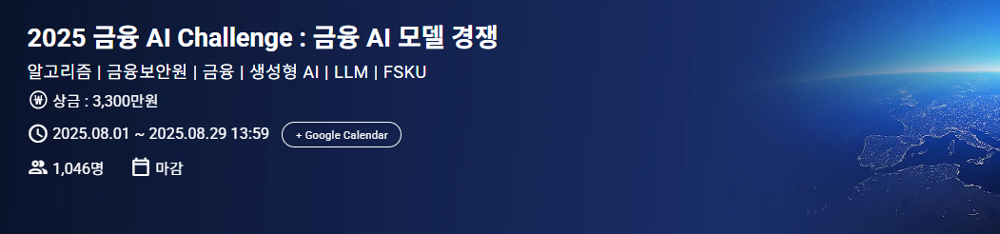
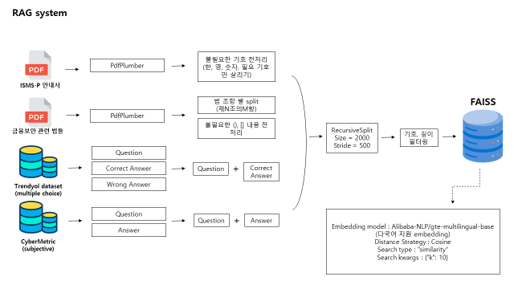

# Finance-AI-chellange


# 2025 금융 AI Challenge : 금융 AI 모델 경쟁
- 주제 : 금융보안 실무에 적합한 개발 방법론 및 AI 모델을 발굴하기 위해 FSKU 평가지표를 기반으로 AI 모델의 성능을 경쟁
- 기간 : 2025.08.01 ~ 2025.08.29
- **Private Score : 0.67721 (1st)**

<br />

## TEAM 뛰어 🧑‍💻👩‍💻

| 이상혁 | 김의진 | 장희진 | 정승민 |
| :---: | :---: | :---: | :---: |
|  |  |  |  |

<br />

## Library

- 자세한 라이브러리는 ./environment 참고

<br />

## Pipeline
- **RAG system**
  


- **LLM system**
  


<br />

## Code

- 모델 다운로드

```bash
python ./model/model_download.py
```

- Preprocessing

```bash
python ./preparing_data/1.\ tech.py
python ./preparing_data/2.\ ISMS.py
python ./preparing_data/3.\ Rag.py
```

- Streamlit

```bash
streamlit run streamlit_app.py
```

<br />

## Model
- RAG 임베딩 모델 : "Alibaba-NLP/gte-multilingual-base" (https://huggingface.co/Alibaba-NLP/gte-multilingual-base)
- Reranker 모델 : "BAAI/bge-reranker-v2-m3" (https://huggingface.co/BAAI/bge-reranker-v2-m3)
- LLM 모델 : "K-intelligence/Midm-2.0-Base-Instruct" (https://huggingface.co/K-intelligence/Midm-2.0-Base-Instruct)

<br />

## Dataset
- ISMS PDF : https://isms.kisa.or.kr/main/ispims/notice/ (KISA 한국인터넷진흥원)
- Law PDF : https://www.law.go.kr/ (국가법령정보센터)
- Tech dataset (multiple) : Trendyol/Trendyol-Cybersecurity-Instruction-Tuning-Dataset
- Tech dataset (multiple) : https://github.com/cybermetric/CyberMetric
