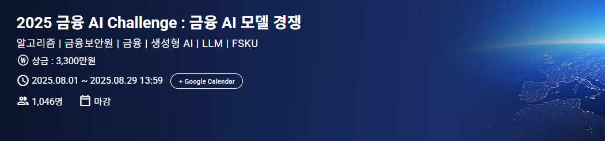
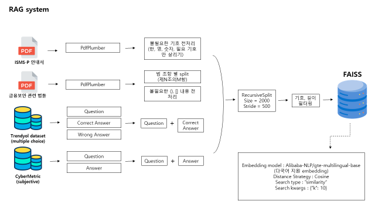
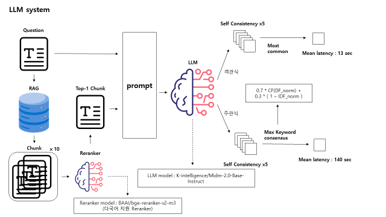

# [Finance AI Challenge](https://dacon.io/competitions/official/236527/overview/description)

 

# 2025 금융 AI Challenge : 금융 AI 모델 경쟁
- 주제 : 금융보안 실무에 적합한 개발 방법론 및 AI 모델을 발굴하기 위해 FSKU 평가지표를 기반으로 AI 모델의 성능을 경쟁
- 기간 : 2025.08.01 ~ 2025.08.29
- **Private Score : 0.67721 (1st)**
- 관련 인터뷰: https://kode.kt.com/blog/article/10174?mainCategoryId=1&subCategoryId=3&nav_info=%2F%3F
<br />

## TEAM 뛰어 🧑‍💻👩‍💻

| 이상혁 | 김의진 | 장희진 | 정승민 |
| :---: | :---: | :---: | :---: |
|  |  |  |  |

<br />

## Library

- 자세한 라이브러리는 ./environment 참고

<br />

## Pipeline
- **RAG system**
  


- **LLM system**
  


<br />

## Code
- Conda Setting 
```bash
conda env create -f conda.yaml
conda activate construct
apt-get update && apt-get install -y ghostscript
```

- Model download

```bash
cd ./model
python ./model_download.py
```

- Preprocessing

```bash
cd ./preparing_data
python 1.\ tech.py
python 2.\ ISMS.py
python 3.\ Rag.py
```

- Streamlit

```bash
streamlit run streamlit_app.py
```

- original --> test.csv inference **(private score 재현 코드)**
```bash
original_code/1.\ RAG.ipynb
original_code/2.\ Inference.ipynb
```
<br />

## Model
- RAG 임베딩 모델 : "Alibaba-NLP/gte-multilingual-base" (https://huggingface.co/Alibaba-NLP/gte-multilingual-base)
- Reranker 모델 : "BAAI/bge-reranker-v2-m3" (https://huggingface.co/BAAI/bge-reranker-v2-m3)
- LLM 모델 : "K-intelligence/Midm-2.0-Base-Instruct" (https://huggingface.co/K-intelligence/Midm-2.0-Base-Instruct)

<br />

## Dataset 
- KISA Data
  - ISMS-P 인증기준 안내서 (2023.11.23) : https://isms.kisa.or.kr/main/ispims/notice/?boardId=bbs_0000000000000014&cntId=21&mode=view
  - ISMS-P 인증제도 안내서 (2024.07) : https://isms.kisa.or.kr/main/ispims/notice/?boardId=bbs_0000000000000014&mode=view&cntId=24
  - KISA 클라우드 서비스 보안인증제도 : https://isms.kisa.or.kr/main/csap/notice/?boardId=bbs_0000000000000004&mode=view&cntId=97  
- Law PDF : https://www.law.go.kr/ (국가법령정보센터)
- Tech Data
  - Trendyol/Trendyol-Cybersecurity-Instruction-Tuning-Dataset (subjective) : https://huggingface.co/datasets/Trendyol/Trendyol-Cybersecurity-Instruction-Tuning-Dataset
  - tihanyin/CyberMetric (multiple choice) : https://huggingface.co/datasets/tihanyin/CyberMetric 
